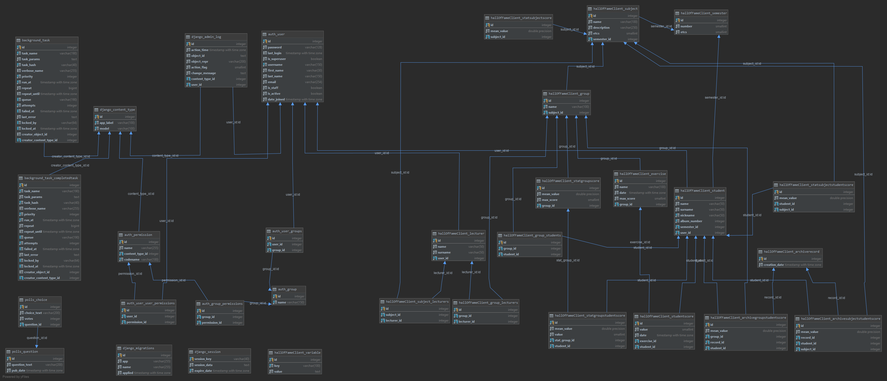

# hall-of-fame
Hall of fame written in DJANGO + PostgreSQL

### Katalogi
- **HallOfFame** - katalog projektu  
- **hallOfFameClient** - katalog wykładowca  
- **hallOfFameStudent** - katalog studenta  
- **hallOfFameWorld** - katalog głównej strony (strona do wyboru lecturer/student)  

### Pliki/podkatalogi
- **templates** - szablony wyglądu (HTML, CSS, JS)
- **models.py** - zdefiniowane modele dla bazy danych
- **views.py** - widoki odpowiedzialne za logikę
- **urls.py** - routing


### Framework Django
Django to framework do języka python przeznaczony do tworzenia aplikacji internetowych.  
Realizuje wzorzec MTV (model-template-view).

### Baza PostgreSQL
PostgreSQL zalicza się do baz typu RDBMS (Relational Database Management System) z rozszerzeniami obiektowymi.  

### Schemat bazy danych


### Opis wybranej funkcji i generowany kod SQL

```py
#Funkcje pomocnicze
def clear_all_stats():
    StatGroupScore.objects.all().delete()
    StatGroupStudentScore.objects.all().delete()
    StatSubjectScore.objects.all().delete()
    StatSubjectStudentScore.objects.all().delete()


def calc_max_score_group(query_group):
    objs = []
    for res in query_group:
        obj = StatGroupScore()
        obj.group_id = res['pk']
        obj.max_score = res['max_score'] or 0
        obj.mean_value = 0
        objs.append(obj)
    return objs


def calc_student_score_group(query_students):
    objs = []
    for res in query_students:
        obj = StatGroupStudentScore()
        obj.student_id = res['student__pk']
        obj.stat_group_id = res['exercise__group__stat_score__pk']
        obj.value = res['score']
        val = res['exercise__group__stat_score__max_score']
        obj.mean_value = res['score'] * 100 / val if val != 0 else 0
        objs.append(obj)
    return objs


def calc_avg_group(query_group_avg):
    objs = []
    for res in query_group_avg:
        obj = StatGroupScore.objects.get(pk=res['stat_group__pk'])
        obj.mean_value = res['mean_value']
        objs.append(obj)
    return objs


def calc_avg_subject(query_subject_avg):
    objs = []
    for res in query_subject_avg:
        obj = StatSubjectScore()
        obj.subject_id = res['group__subject__pk']
        obj.mean_value = res['mean_value']
        objs.append(obj)
    return objs


def calc_subject_student(query_subject_student):
    objs = []
    for res in query_subject_student:
        obj = StatSubjectStudentScore()
        obj.subject_id = res['stat_group__group__subject__pk']
        obj.student_id = res['student__pk']
        obj.mean_value = res['mean_value']
        objs.append(obj)
    return objs


#Główna funkcja
def calc_all_stats(force, to_archive):
    print("Trying calculate")
    curr_date = timezone.now()
    last_date = ArchiveRecord.objects.all().order_by('-creation_date').first()

    create = True
    if last_date is not None:
        diff_hours = (
            curr_date - last_date.creation_date).total_seconds() / 3600
        create = (diff_hours > 24)

    if not create and not force:
        return -1

    # Wyczyszczenie tabel
    clear_all_stats()

    # Oblicznie maxium ptk dla grupy z jej zadań
    query_group = Group.objects.values('pk', ).annotate(max_score=Sum('exercises__max_score'))
    # SELECT "hallOfFameClient_group"."id", SUM("hallOfFameClient_exercise"."max_score") AS "max_score" 
    # FROM "hallOfFameClient_group" 
    # LEFT OUTER JOIN "hallOfFameClient_exercise" ON("hallOfFameClient_group"."id"="hallOfFameClient_exercise"."group_id") GROUP BY "hallOfFameClient_group"."id"

    # Zapisanie wyników w osobnej tabeli
    objs = calc_max_score_group(query_group)
    #bulk_create - jedno zbiorcze zapytanie 
    StatGroupScore.objects.bulk_create(objs)


    #Oblicznie sumy punktów studenta w danej grupie 
    query_students = StudentScore.objects.values("student__pk", 'exercise__group__pk',
                                                 'exercise__group__stat_score__pk',
                                                 'exercise__group__stat_score__max_score').annotate(score=Sum('value'))
    # SELECT "hallOfFameClient_studentscore"."student_id", 
    # "hallOfFameClient_exercise"."group_id", "hallOfFameClient_statgroupscore"."id",
    #  "hallOfFameClient_statgroupscore"."max_score", SUM("hallOfFameClient_studentscore"."value") AS "score" 
    #  FROM "hallOfFameClient_studentscore"
    #  INNER JOIN "hallOfFameClient_exercise"  ON ("hallOfFameClient_studentscore"."exercise_id" = "hallOfFameClient_exercise"."id") 
    #  INNER JOIN "hallOfFameClient_group" ON ("hallOfFameClient_exercise"."group_id" = "hallOfFameClient_group"."id") 
    #  LEFT OUTER JOIN "hallOfFameClient_statgroupscore" ON ("hallOfFameClient_group"."id" = "hallOfFameClient_statgroupscore"."group_id")
    #   GROUP BY "hallOfFameClient_studentscore"."student_id", "hallOfFameClient_exercise"."group_id", "hallOfFameClient_statgroupscore"."id"

    # Zapisanie wyników w osobnej tabeli z obliczeniem procentów
    objs = calc_student_score_group(query_students)
    #bulk_create - jedno zbiorcze zapytanie 
    StatGroupStudentScore.objects.bulk_create(objs)


    #Oblicznie średniej dla danej grupy z punktów studentów 
    query_group_avg = StatGroupStudentScore.objects.values(
        'stat_group__pk').annotate(mean_value=Avg('mean_value'), )
    # SELECT "hallOfFameClient_statgroupstudentscore"."stat_group_id", AVG("hallOfFameClient_statgroupstudentscore"."mean_value") AS "mean_value" 
    # FROM "hallOfFameClient_statgroupstudentscore" GROUP BY
    # "hallOfFameClient_statgroupstudentscore"."stat_group_id"

    # Zapisanie wyników w osobnej tabeli
    objs = calc_avg_group(query_group_avg)
    #bulk_create - jedno zbiorcze zapytanie 
    StatGroupScore.objects.bulk_update(objs, ['mean_value'])


    #Oblicznie średniej dla dane przedmiotu z średnich grup
    query_subject_avg = StatGroupScore.objects.values(
        'group__subject__pk').annotate(mean_value=Avg('mean_value'), )
    # SELECT "hallOfFameClient_group"."subject_id", AVG("hallOfFameClient_statgroupscore"."mean_value") AS "mean_value" 
    # FROM "hallOfFameClient_statgroupscore" 
    # INNER JOIN "hallOfFameClient_group" ON ("hallOfFameClient_statgroupscore"."group_id" = "hallOfFameClient_group"."id") 
    # GROUP BY "hallOfFameClient_group"."subject_id"

    # Zapisanie wyników w osobnej tabeli
    objs =calc_avg_subject(query_subject_avg)
    #bulk_create - jedno zbiorcze zapytanie 
    StatSubjectScore.objects.bulk_create(objs)


    #Oblicznie średniej dla dane przedmiotu z średnich studenta z grup w tym
    #przedmiocie 
    query_subject_student = StatGroupStudentScore \
        .objects.values('student__pk',
                        'stat_group__group__subject__pk').annotate(mean_value=Avg('mean_value'), )
    # SELECT "hallOfFameClient_statgroupstudentscore"."student_id", "hallOfFameClient_group"."subject_id",
    #  AVG("hallOfFameClient_statgroupstudentscore"."mean_value") AS "mean_value" 
    # FROM "hallOfFameClient_statgroupstudentscore" 
    # INNER JOIN "hallOfFameClient_statgroupscore" ON ("hallOfFameClient_statgroupstudentscore"."stat_group_id" = "hallOfFameClient_statgroupscore"."id") 
    # INNER JOIN "hallOfFameClient_group" ON ("hallOfFameClient_statgroupscore"."group_id" = "hallOfFameClient_group"."id")
    #  GROUP BY "hallOfFameClient_statgroupstudentscore"."student_id",
    #  "hallOfFameClient_group"."subject_id"
    
    # Zapisanie wyników w osobnej tabeli
    objs = calc_subject_student(query_subject_student)
    #bulk_create - jedno zbiorcze zapytanie 
    StatSubjectStudentScore.objects.bulk_create(objs)

    if to_archive:
        arch_stats(curr_date)
```